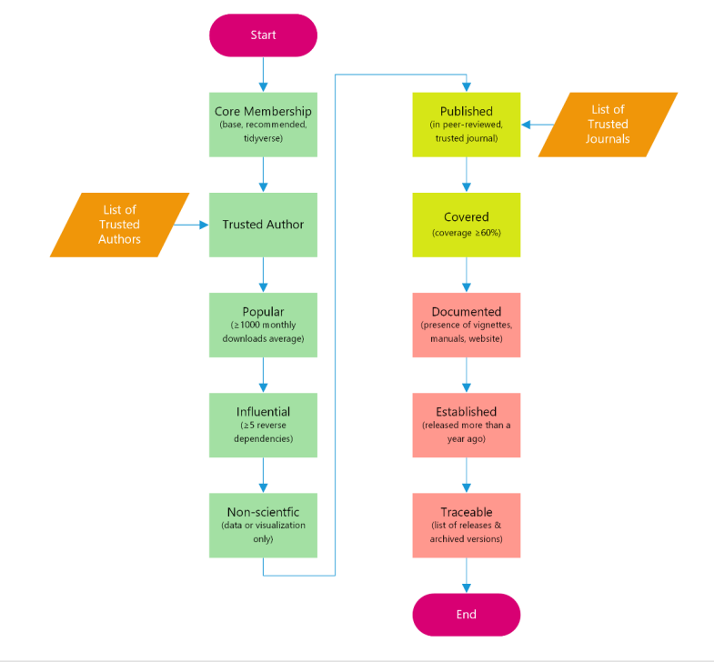

**1 INTRODUCTION**

Whereas data validation is already a standard precursor to any form of scientific analysis in drug development and the validation of in-house built source code used to generate quantitative deliverables follows standard practices as well, the increasing popularity of open source programming languages like R in this context have created a new type of challenge: the validation of the R packages which are imported and used in the drug submission/ approval projects. Such packages are distributed freely, almost always without any warranties, and may be of varying quality. Therefore, Novartis has been working on defining a package risk-based validation approach qualifying R packages. Its risk assessment was designed based on the two business use cases, which reflect current business activities.

**Use case 1:** "standard" packages that are routinely used for drug project submissions and are pre-installed on the platform after being explicitly requested by an associate.

**Use case 2:** new and ad hoc installed packages specific for a given project or user specific that are still to be used for a drug project submission.

**2 R PACKAGE RISK BASED VALIDATION**

A group of Novartis experts have defined ten risk assessment criteria to validate open-source R packages. The steps outlined in this document are aligned with the considerations published by industry consortia such as R Validation Hub [1].

Each criterion was formulated based on the subject matter experts' opinions supported by the publicly available data and was framed as question with two possible answers: "Yes" and "No", where the former must be always supported by the evidence (e.g., link to the source or, less preferably, picture including a date). The questions were categorized into three groups: "Low", "Medium", and "High" risk.

When a package meets criteria from multiple risk groups, it inherits thelowest risk rating.For example, if "Yes" answer is marked in the "Low"and "High" risk group, the final package risk corresponds to "Low". If a package does not meet any criteria it is considered extremely risky and may not be installed at all.

The package risk assessment and testing processes, mentioned in this paper, are aligned with [FDA's](https://www.fda.gov/inspections-compliance-enforcement-and-criminal-investigations/inspection-guides/glossary-computer-system-software-development-terminology-895) validation principles [2] including:establishing documented evidence and providing a high degree ofassurance (accuracy) that a specific process is consistently (reproducibility) meeting its predetermined specifications (traceability) and quality attributes.

A schematic of the process and criteria is provided in Figure 1. As should be evident, several of the criteria include either references to curated lists of trusted sources or "arbitrary" thresholds. Novartis aims to have a systematic and science-based approach to defining these items, e.g., by using classic metrics such as impact factors for journals to determine their credibility, or by comparing download rates to overall download rates of popular R packages. However, we are deeply aware of the futility of attempting to tune these criteria to perfection, as we believe such a focus on "facts" provides a false sense of security that is easily exploited: bad science finds its way into reputable journals all the time and reviewers generally do a bad job of vetting source code, download rates can be inflated through bots, coverage ratings can be rendered meaningless by adding pointless unit tests, etc. Instead, we rely on critical thinking both on the part of the team in charge of installing, validating, and managing these packages as well as on the part of the associates that use them. In this context, the risk categorization serves primarily as directing our attention towards those packages that are likeliest to be problematic but does not absolve us from remaining vigilant at all times.

**3** **MITIGATION OF THE RISK - TESTING REQUIREMENTS**

All open-source packages which are available as pre-installed packages on Novartis platform (use case 1), are installed by IT. Low risk packages do not require business testing (performance qualification), meaning the package functions are not further tested by the users. Medium risk packages, while not meeting the same, strict low risk requirements, are still considered to have adequate evidence to be rated as sufficiently trustworthy for use without dedicated testing.

All the packages which are high risk require business testing (performance qualification) that verifies the main functions that are to be used. Those tests should be written and executed by the end-user (package requestor) or/and by an appointed R Governance Team. The focus of the PQ testing is to ensure that the package functionsthat are likeliest to be used provide scientifically correct results. That is, the main interest lies on ensuring scientific validity, which may or may not be purpose of unit tests written by scientific software developers. The tests themselves and the output of the test executions are documented in a Novartis-internal life cycle management tool and send for QA approval. In the case where a high-risk package appears as a dependency of the requested package, it is treated as if it was explicitly requested by the user.

For use case 2, i.e., packages installed in an ad hoc manner for a specific project, the business process, which is governed by an internal work instruction, is similar. The key difference is the missing tracking through the standard life cycle management tool and therefore the explicit QA approval. Instead, accountability of ensuring sufficient evidence for proving the credibility of the package in question has been gathered lies with the project team itself.

A table below summarizes the mandatory testing steps depending on the package risk and the use case.

|             | Use Case 1 (Production Global Use)                                                                                                                                                                                                                                                                                                                             | Use Case 2 (Ad-Hoc installed package for the drug project submission/approval)                                                                                                                                                                                                                                                                                                                         |
|:-----------------------|:-----------------------|:-----------------------|
| Low Risk    | Installation/Operational Qualification done by IT                                                                                                                                                                                                                                                                                                              | Installation Testing (CMD check) done by the user, e.g., using the Novartis tool (see section 4 for more details)                                                                                                                                                                                                                                                                                      |
| Medium Risk | Installation/Operational Qualification done by IT                                                                                                                                                                                                                                                                                                              | Installation Testing (CMD check) done by the user, e.g., using the Novartis tool (see section 4 for more details)                                                                                                                                                                                                                                                                                      |
| High Risk   | Installation/Operational Qualification done by IT; Performance Qualification Testing is required and must be done in QA environment by Package Requestor; Performance Qualification should test all exported functions intended to be used in the project; The package testing output is stored in the Novartis life cycle management tool and approved by QA. | Installation Testing (CMD check) done by the user, e.g., using the Novartis tool (see section 4 for more details);Ad-hoc installed packages, which are classified high risk should be tested by the end-user;Performance Qualification should test all exported functions intended to be used in the project; The package testing output should be stored in tool folder in the project home directory |

**4 AUTOMATION**

An internal tool has been developed to facilitate and expedite the above process at Novartis and to ensure proper package installation and testing record.

This tool, planned to be made open source in the future, includes -- but is not limited to -- the following functionalities

-   Installation of the package and its dependencies (including suggests) and tests

-   Running of the examples, tests and vignettes, and saving of the test directory to a zip file

-   Ensuring of reproducible MRAN, GitHub, GitLab and BitBucket sourcesby saving their snapshot date or commit sha hash and restoring them on reload

-   Conducting the package risk assessment for a given list of packages and their dependencies and filling out the form

As stated previously, the R governance team acknowledges the risk of attempting to "automate away" the critical thinking. Therefore, the package in question is under continued development, taking in lessons learned with each new release of R packages to the computing platform. Furthermore, the R governance team is developing a shiny application which will further simplify the process of requesting the package, assessing the risk, and testing from the end user's perspective. This tool will allow to have a full overview over the package release history, tested functions, projects the package was used and more.

**5 CONCLUSION**

The validation of R packages is a new and exciting endeavor that entails making judgement calls on various aspects for which little reliable data exists. As such, it is and should be subject to change, evolving over time with the increasing amount of experience gathered. During this forming period (and maybe even beyond), some of the risk assessment criteria will inevitably be based on hard-to-quantify subject matter expert opinion and domain knowledge. Because these can be seen arbitrary from the validation perspective, Novartis is working on systematizing to the extent possible and performs sensitivity analyses to assess the impact of our choices. The addition of new languages to this framework, such as Python or Julia, will bring additional experience that can be leveraged for this purpose.Still, regardless of the outcome of these "best efforts", we consider the universal application of critical thinking to be the single most important ingredient for successful usage of open source packages. It is our deeply held belief that scientific results must be significant and robust enough such that a faulty line of code does not invalidate an entire conclusion, regardless of whether the code in question was written by a Novartis associate or an external author.

**6 REFERENCES**

[1] Andy Nicholls, Paulo R. Bargo, and John Sims. A risk-based approach for assessing r package accuracy within a validated infrastructure. URL: <https://www.pharmar.org/white-paper/.>

[2] Glossary of Computer System Software Development Terminology (8/95). URL: [Glossary of Computer System Software Development Terminology (8/95) \| FDA](https://www.fda.gov/inspections-compliance-enforcement-and-criminal-investigations/inspection-guides/glossary-computer-system-software-development-terminology-895)

Click [here](https://github.com/pharmaR/case_studies/blob/fa5e4c82098266fe7516adaa8671a64c9796a0e3/Novartis_Rpkg_validation_20220509.pdf) to access the full paper including the appendix
