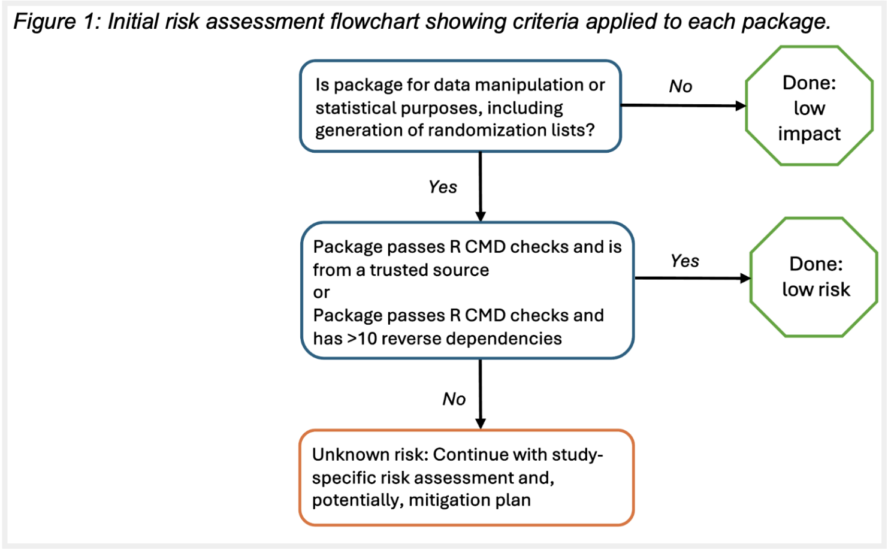
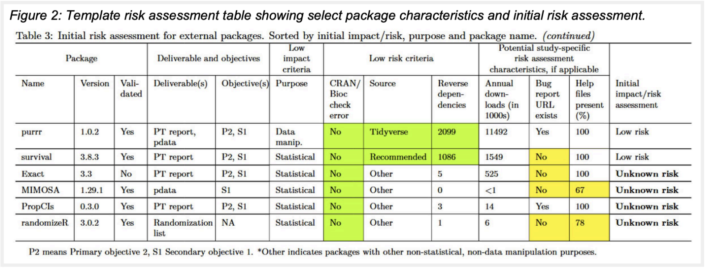

## **Study-Specific Assessment of R Package Risk at SCHARP**

The **Statistical Center for HIV/AIDS Research and Prevention (SCHARP)** at Fred Hutch Cancer Center is a statistical and data management center dedicated to supporting investigators who are leading life-saving, life-changing, innovative research to prevent HIV/AIDS and other infectious diseases. A team from SCHARP recently presented at the PHUSE US-Connect 2026 event hosted in March, detailing their experiences and processes associated with study-specific assessment of R package risk.

The team at SCHARP had historically contributed to regulatory submissions in SAS. However, with the strong preference for R in the HIV vaccine statistical community, it became important to build a rigorous framework for R validation to ensure software reliability and perform risk assessment. Using guidance from the R Validation Hub’s white paper and leveraging the {riskmetric} package, their framework is built around study-specific purpose, software development lifecycle, community usage, and testing. Given SCHARP’s limited resources, the framework is currently mandated only for high-profile trials and is further customized according to each trial’s risk appetite and with an intent to build broader risk assessment experience in their organization.

 

### SCHARP’s Unique Setting and Risk Appetite

SCHARP recognizes that risk appetite ranges; high-impact and regulated areas have formal quality procedures, while exploratory or research projects have more flexibility. Additionally, not all organizations have pharmaceutical-level funding, which could hinder the extent of how far teams go to formally assess R packages and thus influence their risk appetite. In SCHARP’s case, handling NIH-funded clinical trials and managing a non-profit budget determined their moderate risk appetite that suits them best.

### SCHARP’s Statistical Computing Environment

The center’s statistical computing environment (SCE) is managed by a small IT team and consists of Unix computing servers with central R installations—some of which are validated. CRAN, Bioconductor, and public GitHub.com repositories make up their validated package library, though their SCE allows users to download packages from any source.

### SCHARP’s Streamlined R Validation

The team at SCHARP is small, thus taking practical, risk-based approaches to validation and verification is a must. A minimalist approach to R performance qualification (PQ) is pursued by the team with only one test case: if R CMD checks passed or if failed areas had no current impact. Such limited PQ is justified by later study-specific planning.

### SCHARP’s R Usage Plan

A qualitative approach to risk assessment was pursued for three main reasons:

1.  Error data to train and validate scores on is currently unavailable to the team as they are new to risk assessment 

2.  Judgement calls are required to create overall scores, such as many alternative rationales and methodologies across domains and risk categorization thresholds 

3.  Automated risk rules would discourage team members (study leads) from developing their own understanding of package characteristics and their application to specific studies

While the team is still learning about package characteristics, this approach encourages further learning and once experience is gained, could potentially lead to more quantitative approaches.

The template R usage plan selects package characteristics using {riskmetric} alongside custom code. Information related to study-specific usage, purpose, and validation status is also considered. A semi-automated initial risk assessment helps create a smaller subset of packages needing further, time-consuming study-specific risk assessment. In their process guidelines, there are also examples and prompts to lead their staff to conduct qualitative study-specific risk assessment and to develop a risk mitigation plan as needed. The usage plan ends with the statistical team’s steps to maintain continuity and stability of R throughout their study.\

In the R usage plan, the following package characteristics are considered for externally-developed packages (with the first four being required which is consistent with the R Validation Hub white paper):

-   Purpose

-   Passing R CMD checks

-   Trusted source (base R, recommended, Tidyverse)

-   Number of reverse dependencies

-   Number of annual downloads

-   Bug report URL exists

-   Help files present  

The last 3 characteristics are optional, as are any other characteristics the study team deems relevant.

### SCHARP’s Programmatic Initial Risk Assessment

The initial risk assessment is in place to quickly identify packages needing more scrutiny, to free the risk assessor from devoting effort to review of packages which do not have concerning characteristics. The same rules are applied across their organization, however teams can make rules stricter. Mutually exclusive categories of low impact, low risk, and unknown risk are used in the assessment. Known examples of low impact packages for the SCHARP team are ggplot2 and knitr, as they create visualizations and results rather than manipulate data, i.e. they have non-statistical purpose. When packages are not considered low impact, they undergo the risk check. Trusted source packages for this assessment are base R, CRAN-recommended packages, and the Tidyverse, as these developers follow an SDLC with testing and are leaders in maintenance. See Figure 1 from their paper below, which is the flowchart of the initial risk assessment.

 

 

Most of the initial risk assessment is performed programmatically (deliverables, objectives and purpose are entered manually for each study) and produces a Rmarkdown report leveraging {riskmetric}. A template risk assessment table can be seen in Figure 2 from their paper below.

 

 

### SCHARP’s Study-Specific Risk Assessment

Packages that undergo study-specific risk assessment must be rated as either low (reliability is expected), high (lacking confidence in reliability) or unknown risk (unclear if low or high). There are a variety of characteristics to consider for study-specific risk assessment, and the team at SCHARP hopes to help statistical teams that are new to package risk assessment with recommendations as follows:

-   The likelihood of encountering problems with package use should be considered, with higher risk of problems stemming from package characteristics like having fewer downloads and reverse dependencies, as well as being at a development version (i.e. \<1.0.0).

-   Consider the ease of troubleshooting a package, with those providing help files and a URL for bug reporting and fixes being favorable.

-   Study context considerations are also important, and the statistical team can review literature or test statistical functions for their operating characteristics under relevant scenarios.

-   Gauging a package’s unit test coverage is also important, as unit tests covering used functions can imply lower risk

Ultimately, statistical team members at SCHARP have to make their own documented study-specific decisions, with a thoroughly reasoned qualitative assessment in which a balance of strengths and weaknesses of packages is considered. The process acknowledges the rationale for these decisions may be subjective and dependent on the assessor’s risk tolerance. The following example for {randomizeR} illustrates the study-specific risk assessment, and role of risk appetite.

> The assessor for study A is evaluating the package randomizeR for producing randomization lists. The assessor notes a small number of reverse dependencies and downloads as well as incomplete help file documentation as weaknesses. They also note non-developmental version, the long history of the package, a robust JSS paper (Uschner 2018), and available help documentation for functions needed for the study as strengths. For context when determining the availability of help documentation, the assessor also notes that while the riskmetric export_help metric \< 1 indicated some missing help files, help files were in fact missing only for internal and hidden objects and all documentation for user-facing functions needed for the study was available. During a discussion with the lead statistician about the pros and cons, they consider low versus uncertain risk as two competing possibilities. Although of potentially low risk, to err on the side of caution, they decide to categorize the package as uncertain risk. (Note that a more risk-tolerant study team may have gone with low risk!)

### Conclusion

By pairing a mostly programmatic initial assessment with a qualitative study-specific review, SCHARP has built an R validation framework that's manageable for a small team while still meeting the rigor demanded by clinical research.

 

Read their full paper, “Handle with Care: Study-Specific Assessment of R Package Risk,” **here**.
